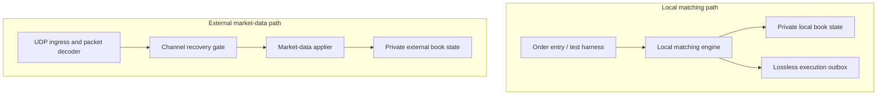
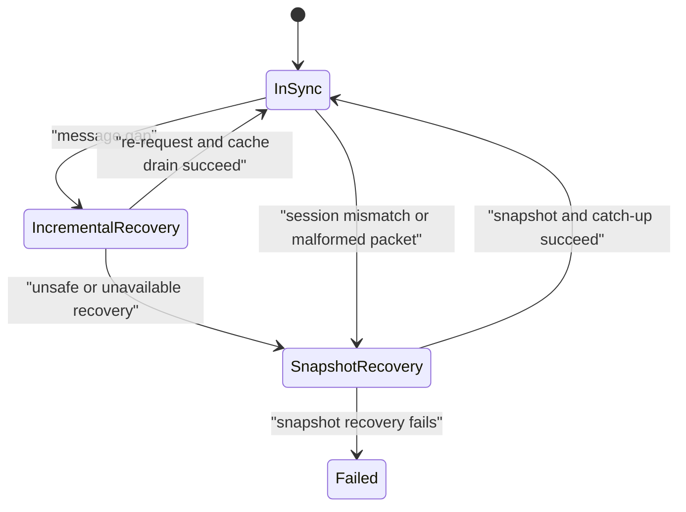

# Limit Order Book Architecture

**Status:** Draft v0.1
**Scope:** Local matching engine now; external multicast market-data
reconstruction in a later phase.

## 1. Purpose and authority

This document defines component boundaries, ownership, data flow, and failure
handling for the Limit Order Book (LOB) system.  It explains *where* behavior
lives; [`book-rules.md`](book-rules.md) defines *what* that behavior must be.

Project decisions follow this authority order:

1. `docs/book-rules.md` defines normative behavior.
2. `docs/architecture.md` defines ownership and architectural boundaries.
3. `TODO.md` defines implementation order and acceptance gates.
4. `AGENTS.md` defines the required build, validation, repository, and agent
   workflow.

A lower-ranked document must not silently reinterpret a higher-ranked one.

## 2. Scope and phased delivery

| Phase | Deliverable                                                                                         | Concurrency model                                                           |
| ----- | --------------------------------------------------------------------------------------------------- | --------------------------------------------------------------------------- |
| 1     | Correct local matching engine for one instrument per book                                           | Synchronous direct calls; one writer; no sockets or queues.                 |
| 2     | Fixed-size object-pool allocator and memory measurements                                            | Still single-writer; no required additional threads.                        |
| 3     | External outbound multicast market-data feed handler, incremental re-request, and snapshot recovery | Bounded hand-offs and independently owned I/O; no concurrent book mutation. |

CPU pinning, NIC/IRQ tuning, and additional threads are performance work for
Phase 3 or later.  They are not correctness requirements for Phases 1–2.

## 3. Architectural principles

* **Behavior before optimization.** Preserve price-time priority and all book
  invariants before introducing pools, lock-free queues, or CPU affinity.
* **One writer per book.** Only its owning serial executor may mutate a book.
  Readers receive events or immutable snapshots; they never inspect internal
  orders or price levels directly.
* **Separate semantics.** Local matching and external market-data
  reconstruction are separate logical book instances.  They may reuse code,
  but they never share mutable state or event streams.
* **Bounded work.** Hot paths avoid exceptions, unbounded queues, uncontrolled
  allocation, and blocking I/O.
* **Fail closed for lossless output.** A mutation that requires mandatory
  output does not commit until its complete output batch has reserved capacity.
* **Recover by channel.** A multicast channel, not an individual instrument,
  owns sequence state and recovery because one packet can contain messages for
  several instruments.

## 4. Logical topology

The two paths are deliberately not connected.  If the project later publishes
the local engine's activity over UDP, that is an **outbound publisher**, not an
external market-data feed handler.

## 5. Components and ownership

| Component                      | Owns                                                                              | Responsibilities                                                                                                  | Must not do                                                         |
| ------------------------------ | --------------------------------------------------------------------------------- | ----------------------------------------------------------------------------------------------------------------- | ------------------------------------------------------------------- |
| Local matching engine          | One local matching-book executor and its state                                    | Validate `New`/`Cancel`/`Amend`, match orders, and create execution reports.                                      | Decode packets, perform I/O, or mutate an external book.            |
| `OrderBookStorage`             | Order-ID index, price-level indexes, FIFO queues, aggregates, and order memory    | Represent local or external book state privately for its owner.                                                   | Expose mutable nodes or accept concurrent access.                   |
| Lossless execution outbox      | Reserved report slots and system-status control capacity                          | Reserve, commit, and fan out mandatory local output.                                                              | Drop a committed execution report or permit partial output batches. |
| UDP ingress and packet decoder | Socket interaction and receive buffers                                            | Receive datagrams; validate framing, lengths, and checksums; produce packet envelopes.                            | Apply messages to a book or decide recovery state.                  |
| Channel recovery gate          | Per-channel session, expected message sequence, bounded cache, and recovery state | Sequence packets, perform incremental re-request, select snapshot recovery, and release only contiguous messages. | Mutate order nodes directly or block on consumer work.              |
| Incremental re-request client  | Request transport for a bounded missing message range                             | Request and return retransmitted packets to the recovery gate.                                                    | Decide channel state or apply messages.                             |
| Snapshot client                | Snapshot transport and response bytes                                             | Request a complete channel snapshot and return its watermark plus payload.                                        | Mark books current or drain cached live data.                       |
| Market-data applier            | One external market-data-book executor per assigned book/shard                    | Apply normalized external `Add`, `Cancel`, `Execute`, snapshot, and status events.                                | Match orders or accept local order-entry commands.                  |
| Output consumers               | Their own read-side state                                                         | Consume execution, status, or analytics output.                                                                   | Read a book's private memory or stall a book writer.                |

## 6. Local matching path

Phase 1 calls the local matching engine directly from tests or a simple local
application.  There is no dispatcher or queue requirement at this stage.

For a mutating command capable of producing lossless output, the engine uses
this lifecycle:

1. **Validate** the command, identifier, price, quantity, and instrument state.
2. **Plan** the fills and the exact mandatory output batch without changing the
   book.
3. **Reserve** space for every required execution report in the lossless
   outbox.
4. **Execute** the planned order, queue, and aggregate mutations, writing the
   reports into the reserved slots.
5. **Commit** the batch and advance the engine sequence.

`Commit` is infallible by design because output capacity and all required memory
were secured before mutation.  If reservation fails, no order mutation occurs;
the local matching book enters `Halted` and publishes a system-status event
through separately reserved control capacity.

`OrderBookStorage` is private to the matching engine.  The initial baseline
uses an order-ID lookup, price-level indexes, and FIFO queues; Phase 2 may
replace per-order allocation with a fixed-size object pool without changing
the public behavior or component boundary.

Milestone 3 implements the `Plan` and `Execute` sides of this lifecycle for
`NewOrder`.  Its internal fixed-size plan records at most 256 resting order
IDs, resting prices, and fill quantities, plus the aggressive remainder.  The
planning pass traverses immutable storage views in price-time order and makes
no mutation or sequence assignment.  Final active-order, price-level,
aggregate, match-ID, and engine-sequence capacity are checked before the plan
is executed.

Until Milestone 5 adds the production lossless outbox, `process(NewOrder)`
returns a bounded synchronous result containing the committed execution
reports.  Engine sequences and match IDs are assigned only after a fully
preflighted plan has been applied and before the result becomes observable to
the caller.  No outbox reservation or fail-closed outbox behavior is modeled
in Milestone 3.  Milestone 5 inserts `Reserve` between the existing plan and
execution steps; it does not replace the match plan or introduce a competing
transaction model.

Milestone 4 reuses that same match planner for price-changing amendments by
describing both a new order and an amended order as one private logical
aggressive order.  The amended order remains in its original FIFO location
while the engine plans fills and preflights the final state.  Capacity
accounting logically subtracts the replaced order and any fully filled resting
orders before adding an amended remainder; only then does execution remove the
old representation, apply the shared fill plan, and append any remainder.
Cancel and same-price amendments produce zero reports, while a marketable
amendment returns its exact bounded report batch through the same synchronous
result representation.  Physical outbox reservation and publication remain
deferred to Milestone 5.

## 7. External market-data path

Phase 3 reconstructs a separate venue's book from an outbound multicast feed.
It does not place or match local orders.

### 7.1 Packet and event flow

1. UDP ingress receives a datagram and validates its transport/application
   framing.
2. The packet decoder emits a bounded `PacketEnvelope` containing at least
   `ChannelId`, `SessionId`, `FirstMessageSequence`, `MessageCount`, and its
   validated message blocks.
3. The `ChannelRecoveryGate` is the sole owner of expected-sequence and
   recovery state for that channel.
4. Only when the gate releases a contiguous sequence does the market-data
   applier receive normalized `MarketDataEvent` values.
5. The applier updates the external market-data books and publishes their
   permitted outputs.

Packet decoding may occur on the ingress thread.  The recovery gate and
market-data applier MAY initially run on the same serial executor; split them
only after measurement demonstrates a benefit.  Regardless of threading, the
applier remains the only writer of each external book.

### 7.2 Channel sequencing and recovery

Each channel tracks message sequence, not merely packet count.  A packet can
contain multiple messages, and the header identifies the first message's
sequence.  The following messages are implicitly sequential.

For an ordinary recoverable gap, the gate retains current external book state,
marks every book assigned to that channel unavailable, caches later packets,
and requests the missing message range.  It applies neither live nor recovered
data out of sequence.  After it applies the missing range and drains the
contiguous cache, the channel returns to `InSync`.

Snapshot recovery is the catastrophic fallback.  It is required after session
mismatch, malformed data, invalid or unavailable re-request, timeout, cache
overflow, restart, or another condition that makes preserved state unsafe.  A
snapshot response must identify its session and last included message sequence
(watermark).  The gate clears all external books on that channel, applies the
snapshot, sets the expected sequence to the message after the watermark, and
then drains only later cached messages in order.

The simulator's short-gap profile uses UDP-unicast re-request.  A TCP service
may supply complete snapshots; it is not part of ordinary incremental replay.

## 8. Data contracts

All hot-path contracts are fixed-size or bounded, use integer prices and
quantities, and contain no dynamically allocated symbol strings.

| Contract          | Producer              | Consumer                            | Key contents                                                                     |
| ----------------- | --------------------- | ----------------------------------- | -------------------------------------------------------------------------------- |
| `OrderCommand`    | Local caller          | Local matching engine               | `OrderId`, `InstrumentId`, side, tick price, quantity, command kind.             |
| `ExecutionReport` | Local matching engine | Lossless execution outbox           | Match ID, aggressive/resting IDs, price, quantity, engine sequence.              |
| `SystemStatus`    | Book or recovery gate | Lossless status path                | Scope, state transition, reason, and sequence/watermark when applicable.         |
| `PacketEnvelope`  | UDP ingress/decoder   | Channel recovery gate               | Channel/session identity, first message sequence, count, bounded payload.        |
| `MarketDataEvent` | Recovery gate         | Market-data applier                 | External add/cancel/execute/snapshot/status event plus channel message sequence. |
| `MarketExecution` | Market-data applier   | Lossless consumer path when enabled | External fill information; never invents an aggressive local order ID.           |
| `BookUpdate`      | Book writer           | Analytics/UI path                   | Immutable best-price, depth, or delta information; eligible for conflation.      |

`EngineSequence` is assigned by the local matching engine.  A channel message
sequence belongs to the external feed and is never used as a substitute for an
engine sequence.

## 9. Egress and delivery guarantees

| Output class             | Delivery rule                       | Backpressure behavior                                                       |
| ------------------------ | ----------------------------------- | --------------------------------------------------------------------------- |
| Local `ExecutionReport`  | Lossless and ordered                | Reserve the complete batch before mutation; if unavailable, fail closed.    |
| `MarketExecution`        | Lossless and ordered when published | Use a bounded lossless path; do not silently discard.                       |
| `SystemStatus`           | Lossless and ordered                | Use reserved control capacity so a full fills queue cannot suppress a halt. |
| `BookUpdate` / analytics | Lossy or conflated                  | Keep the newest useful state; drop intermediate updates when full.          |

Each independently scheduled consumer needs its own queue or a dedicated
fan-out mechanism.  A single SPSC queue cannot safely serve multiple consumer
threads.  The writer never waits for a UI or analytics consumer.

The exact persistence mechanism for the lossless outbox is deferred.  An
in-memory bounded ring protects the process lifetime; true crash durability
requires a later write-ahead log or equivalent durable store.

## 10. Threading and memory model

### 10.1 Phase 1

* One thread invokes the local matching engine.
* The engine is the sole reader and writer of its local book state.
* Tests call the public API directly; they require no socket, ring buffer, or
  scheduler.

### 10.2 Phase 3 target

* A UDP ingress owner receives datagrams and hands off bounded packet envelopes
  to the relevant channel gate, either directly or through an SPSC queue.
* A channel gate is the sole writer of its recovery state and cache.
* A market-data applier is the sole writer of every assigned external book.
* Snapshot and re-request I/O may be asynchronous, but their results return to
  the channel gate for sequencing; I/O clients never mutate a book.
* Outbound queues use explicit ownership: one producer and one consumer for an
  SPSC ring, or a separately specified fan-out design.

CPU affinity can reduce core migration but does not eliminate interrupts or
context switches.  Add it only after profiling demonstrates that the chosen
thread layout benefits from it.

## 11. Failure and observability rules

* Public mutation paths do not use C++ exceptions.  They return explicit result
  codes and leave book data unchanged on ordinary rejection.
* Lossless output-capacity failure is a fail-closed state transition, not an
  accepted partial match.
* Malformed market-data packets are logged, never applied, and trigger channel
  snapshot recovery.
* Recovery, resets, lossless-outbox faults, and status changes emit bounded,
  structured diagnostics with channel/instrument IDs and relevant sequences.
* Debug builds expose invariant validation after every mutation.  Production
  hot paths must not rely on unbounded diagnostic logging.

## 12. Validation strategy

* Unit-test local matching independently of all networking.
* Compare randomized local command streams with a simple reference model.
* Test the packet decoder with binary fixtures, including multi-message and
  multi-instrument packets.
* Test channel recovery with deterministic packet loss, duplicates, stale
  packets, session changes, malformed data, timeout, cache overflow, and
  snapshot-watermark catch-up.
* Test lossless outbox reservation with multi-fill commands so no partial book
  mutation is possible when output capacity is insufficient.
* Run the Debug suite under ASan and UBSan.  Run ThreadSanitizer only after a
  concurrency milestone adds shared state or inter-thread queues.

## 13. Deferred decisions

The following decisions are intentionally deferred but require a dedicated
specification before their implementation:

1. Exact binary wire format, checksum algorithm, maximum packet size, and
   maximum message count (`docs/market-data-protocol.md`).
2. Snapshot payload format, transport request/response framing, and retention
   policy.
3. Lossless-outbox crash-persistence mechanism and capacity configuration.
4. Channel-to-instrument assignment, multi-book sharding, and consumer fan-out
   strategy at larger scale.
5. Benchmark workloads, latency targets, and the evidence required before
   replacing baseline storage with specialized ladders or allocators.
